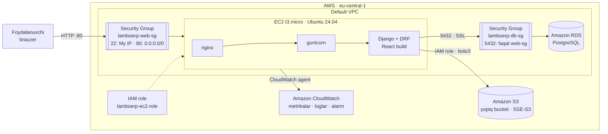

# Lamborghini ERP — bulutli infratuzilma bo'yicha texnik hisobot

> **Qoralama.** `[SKRINSHOT: ...]` belgilangan joylarga AWS konsolidan olingan skrinshotlarni qo'ying,
> `<...>` qiymatlarini o'zingiznikiga almashtiring. Parol, access key va boshqa maxfiy ma'lumotlarni
> skrinshotlarda ham ko'rsatmang.

**Talaba:** <F.I.Sh.> · **Guruh:** ATT 01-24 · **Fan o'qituvchisi:** Uzoqov Lochinbek

---

## 1. Loyiha nomi va turi

**Lamborghini ERP System** — **ERP** (Enterprise Resource Planning) tizimi.

## 2. Loyihaning qisqacha vazifasi

Lamborghini dilerlik markazlari tarmog'ini boshqarish: filiallar, avtomobillar inventari va sotuvi (Kanban pipeline),
ehtiyot qismlar ombori (kirim/chiqim, kam qolgan detallar), avtoservis buyurtmalari, xodimlar maoshi va KPI,
boshqaruv analitikasi hamda hujjatlar (invoice, shartnoma, hisobot). Tizimda 4 ta rol bor:
Bosh Boshqarma, Sotuv menejeri, Omborchi, Servis ustasi — har biri faqat o'z filiali ma'lumotlarini ko'radi.

## 3. Texnologiyalar

| Qism | Texnologiya |
|---|---|
| Backend | Python 3.12, Django 6.1, Django REST Framework, SimpleJWT |
| Frontend | React 19, Vite, TailwindCSS, Recharts, Axios |
| Web server | nginx (reverse proxy) + gunicorn (WSGI), systemd |
| Ma'lumotlar bazasi | PostgreSQL (Amazon RDS) |
| Fayllar | Amazon S3 (`django-storages`, `boto3`), invoice PDF — ReportLab |

## 4. Bulut provayderi va ishlatilgan xizmatlar

**Amazon Web Services**, region **eu-central-1 (Frankfurt)**.

| Xizmat | Vazifasi |
|---|---|
| Amazon EC2 | Web-ilova ishlaydigan virtual server (t3.micro, Ubuntu 24.04) |
| Amazon RDS (PostgreSQL) | Boshqariladigan ma'lumotlar bazasi |
| Amazon S3 | Hujjatlar va invoice PDF fayllarini saqlash |
| AWS IAM | EC2 uchun role — S3 va CloudWatch'ga minimal ruxsat, access key'siz |
| Security Groups | Tarmoq darajasidagi firewall (EC2 va RDS uchun alohida) |
| Amazon CloudWatch | Metrikalar (CPU, RAM, disk), loglar, alarm |

## 5. Bulut arxitekturasi sxemasi

`[SKRINSHOT: GitHub'da ko'rsatilgan diagramma yoki draw.io versiyasi]`

## 6. Komponentlar tavsifi

### 6.1. Compute — Amazon EC2
- Instance: `t3.micro`, Ubuntu Server 24.04 LTS, 8–20 GB gp3, public IP: `<IP>`
- nginx 80-portda so'rovlarni qabul qilib, `127.0.0.1:8000` dagi gunicorn'ga uzatadi; gunicorn tashqariga ochilmagan.
- Ilova `systemd` servisi (`lamboerp.service`) sifatida ishlaydi — server qayta yuklanganda avtomatik ko'tariladi.
- Sozlamalar `/home/ubuntu/lamboerp/.env` faylida (GitHub'da yo'q).

`[SKRINSHOT: EC2 instance — Details (type, AMI, public IP, IAM role)]`
`[SKRINSHOT: terminalda systemctl status lamboerp]`

### 6.2. Database — Amazon RDS PostgreSQL
- `db.t4g.micro`, PostgreSQL <versiya>, 20 GB, **Public access: No**.
- Django `DB_HOST` va boshqa parametrlarni `.env` dan oladi; ulanish `sslmode=require` bilan shifrlangan.
- Ilova (EC2) va baza (RDS) mantiqan alohida xizmatlar.

`[SKRINSHOT: RDS — Connectivity & security (endpoint, Public access: No, SG)]`
`[SKRINSHOT: /api/health/ javobi — "engine": "postgresql"]`

### 6.3. Storage — Amazon S3
- Bucket `<bucket>`: Block all public access yoqilgan, SSE-S3 shifrlash.
- ERP hujjatlari: buyurtma uchun **invoice PDF** avtomatik yaratiladi va S3'ga yoziladi; foydalanuvchilar
  shartnoma, hisobot va boshqa fayllarni (PDF, rasm, Word, Excel, 10 MB gacha) yuklaydi.
- Fayllar `lamboerp/documents/YYYY/MM/` prefiksida; yuklab olish faqat ilova orqali (JWT + filial ruxsati).

`[SKRINSHOT: ilovadagi "Hujjatlar" sahifasi — "Saqlash joyi: Amazon S3"]`
`[SKRINSHOT: S3 konsolida lamboerp/documents/... ichidagi PDF]`
`[SKRINSHOT: obyekt URL'ini to'g'ridan-to'g'ri ochganda AccessDenied]`

### 6.4. Security — Security Groups va IAM

| Security Group | Port | Manba | Vazifasi |
|---|---|---|---|
| lamboerp-web-sg | 22 (SSH) | Mening IP | Serverni boshqarish |
| lamboerp-web-sg | 80 (HTTP) | 0.0.0.0/0 | Web-ilovaga kirish |
| lamboerp-db-sg | 5432 (PostgreSQL) | lamboerp-web-sg | Faqat ilova serveri bazaga ulanadi |

IAM role `lamboerp-ec2-role`:
- `LamboErpS3Documents` — faqat bitta bucket'ning `lamboerp/*` prefiksiga `PutObject`, `GetObject`, `DeleteObject`
  va bucket bo'yicha `ListBucket` (minimal zarur huquqlar).
- `CloudWatchAgentServerPolicy` — metrika va log yuborish.

`[SKRINSHOT: Security Group inbound rules (ikkalasi)]`
`[SKRINSHOT: IAM role — Permissions policies]`

### 6.5. Monitoring — Amazon CloudWatch
- EC2 standart metrikalari: `CPUUtilization`, `NetworkIn/Out`.
- CloudWatch agent: `mem_used_percent`, disk `used_percent` (namespace `LamboERP`),
  loglar: `/lamboerp/app` (gunicorn), `/lamboerp/nginx`.
- Alarm: CPU > 80% (5 daqiqa) → SNS → email.
- Ilovaning holat endpoint'i: `GET /api/health/` — baza va S3 ulanishini tekshiradi.

`[SKRINSHOT: CloudWatch metrika grafigi / dashboard]`
`[SKRINSHOT: Log group ichidagi gunicorn loglari]`
`[SKRINSHOT: Alarm holati]`

## 7. Xavfsizlik bo'yicha amalga oshirilgan choralar

1. Maxfiy ma'lumotlar (Django `SECRET_KEY`, RDS paroli) faqat serverdagi `.env` faylida; `.env` `.gitignore` da.
2. AWS access key / secret key ishlatilmaydi — EC2 IAM role orqali vaqtinchalik ruxsat.
3. IAM — minimal huquqlar: bitta bucket, bitta prefiks, faqat kerakli amallar.
4. RDS internetga ochiq emas; 5432-port faqat ilova serverining Security Group'idan; SSL ulanish.
5. S3 — Block Public Access, server tomonida shifrlash (SSE-S3), fayllar faqat avtorizatsiya orqali.
6. SSH faqat talabaning IP manzilidan; gunicorn faqat localhost'da.
7. Ilova darajasida: JWT autentifikatsiya, rollar va filial bo'yicha ruxsatlar, yuklanadigan fayl turi va hajmi cheklovi,
   `DEBUG=False`.

## 8. Asosiy skrinshotlar

`[SKRINSHOT: http://<IP>/ — login sahifasi]`
`[SKRINSHOT: Analitika sahifasi]`
`[SKRINSHOT: Sotuv Kanban va Invoice tugmasi]`

## 9. Yakuniy xulosa

Mavjud ERP web-ilovasi AWS bulut infratuzilmasiga ko'chirildi: ilova EC2'da nginx + gunicorn orqali public IP'da
ishlaydi, ma'lumotlar boshqariladigan Amazon RDS PostgreSQL bazasida, hujjatlar va invoice'lar Amazon S3'da saqlanadi.
Xavfsizlik Security Group'lar va minimal huquqli IAM role orqali ta'minlandi, maxfiy ma'lumotlar kod va GitHub'dan
tashqarida. Server va ilova holati CloudWatch metrikalari, loglari va alarm orqali kuzatiladi.
<Xulosaga o'z fikringizni qo'shing: nimani o'rgandingiz, qanday qiyinchiliklar bo'ldi.>
